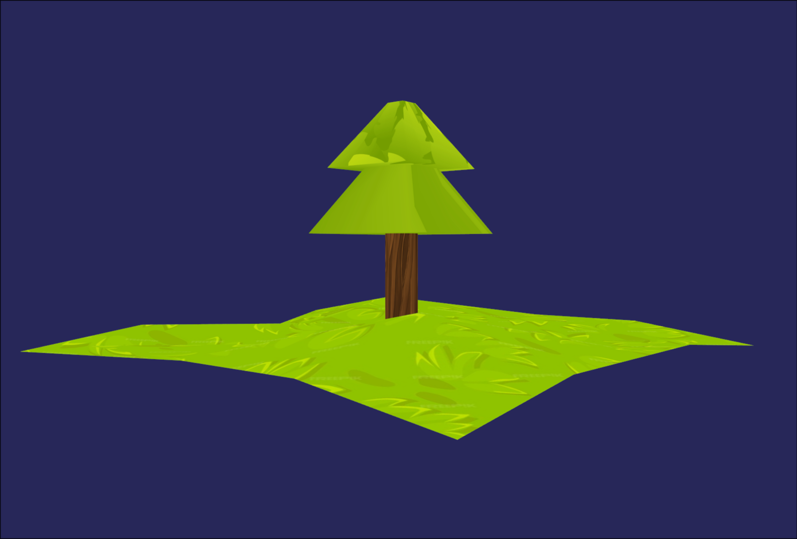

# Skadi Engine


## Features
**Vulkan Render Engine**

Skadi Engine has been build with a custom render engine that can handle glTF models and textures straight from blender. Importing to the engine's formats is made easy with a custom API that handles loading for you. Even better, Skadi's rendering runs on a separate thread to ensure the best possible performance for your code.

**Input System**

Skadi features a simple to use, lambda based input system that lets you connect any key press to any function or lambda. You can also connect multiple keys to create an axis to make basic keyboard movement even simpler.

Example:
```C++
Vector2 planeAxis = input.getKeyAxis("Left", "Right", "Forward", "Backward");
int vertAxis = input.getKeyAxis("Down","Up");
int rotAxis = -input.getKeyAxis("RotLeft", "RotRight");

Vector3 moveDir(planeAxis.x, vertAxis, planeAxis.y);
```

**ECS Based Object Storage**

Skadi uses a id -> component system that is managed with a sparse set. This offers better performance than traditional tree like structures as all objects live in memory concurrently. Simply allocate an entity from a scene's entity manager and then link it to a new mesh with the component manager.

Example:
```C++
Scene scene(10);

SparseSet<Mesh>* meshComponents = scene.componentManager.getComponents<Mesh>();
for (auto& mesh : meshes) {
	Entity box = scene.entityManager.allocEntity();
	meshComponents->add(box, mesh);
}
```

**Camera Matrix Transformation**
In Skadi, you can easily move and rotate the camera with GLM math integration. Simply perform the move and rotate operations that you like and then update the camera in the renderer.

Example:
```C++
glm::mat4 camMat(1);
camMat = translate(camMat, moveDir.glm() * flyspeed);
camMat = rotate(camMat, rotAxis * turnspeed, glm::vec3(0,1,0));
rend.camera.setTransform(camMat);
```

## Planned Features

- Bullet Physics integration
- Transformation heirarchy
- Custom lighting and shader graphics
- Multiplatform project exporting
